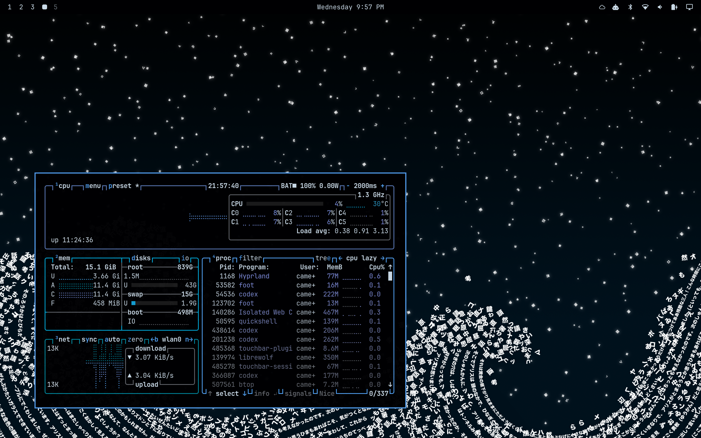

# solo-dwindle

Adaptive single-window placement for Hyprland's Dwindle layout.



*A terminal using its saved solo placement on an otherwise empty workspace.*

`solo-dwindle` leaves ordinary Dwindle behavior alone when a workspace has
multiple windows. When a known application is the only window, it floats at a
saved monitor-relative size and position. Unknown applications remain tiled
until you deliberately float and arrange them once; that placement is then
remembered for future launches.

The module was built for Omarchy's Lua-based Hyprland configuration and is
currently experimental.

## Behavior

- A terminal has a built-in default solo placement.
- An unknown app opens as a normal full-workspace Dwindle window.
- Floating and adjusting a sole unknown app teaches its placement by initial
  window class.
- Opening a second window returns both windows to normal Dwindle, keeping the
  established window on the left.
- Closing the second window restores the remaining app's solo placement.
- Toggling a known solo window to tiled and back to floating restores its saved
  placement.
- Move and resize changes are saved automatically after the window settles.
- Naturally floating dialogs are not learned unless that exact window was
  first observed tiled and was then deliberately adjusted.

## Requirements

- Hyprland with the Lua configuration API. This version is tested with
  Hyprland 0.56.2.
- A normal workspace using the `dwindle` tiled layout.
- Omarchy, or an equivalent Lua configuration that provides the `hl` API and
  loads modules from `~/.config`.

The included terminal profile matches Omarchy's `terminal` window tag. Other
setups can replace it with their own tag or class.

## Installation

Clone the repository and link the module into your Hyprland configuration:

```bash
git clone https://github.com/cameroncooper/solo-dwindle.git ~/.local/share/solo-dwindle
ln -s ~/.local/share/solo-dwindle/solo-dwindle.lua ~/.config/hypr/solo-dwindle.lua
mkdir -p ~/.local/state/omarchy/windows
```

Then load it near the end of `~/.config/hypr/hyprland.lua`, after your normal
Omarchy defaults and personal modules:

```lua
require("hypr.solo-dwindle")
```

Apply and validate the configuration:

```bash
hyprctl reload
hyprctl configerrors
```

## Teaching an application

1. Open the app by itself on a blank Dwindle workspace. It will initially fill
   the workspace.
2. Press `SUPER + T` to float it.
3. Let the float animation finish, then use `SUPER + left drag` to move it and
   `SUPER + right drag` to resize it.
4. Stop moving it for about a second.

A notification confirms that the placement was saved. Future sole windows
with the same initial window class will use that placement automatically.
Simply floating an app without adjusting it does not teach a preference.

## Configuring built-in profiles

Profiles near the top of `solo-dwindle.lua` provide defaults for apps that
should work before they have been taught:

```lua
local profiles = {
  {
    key = "terminal",
    tag = "terminal",
    default = { x = 0.06, y = 0.48, w = 0.46, h = 0.44 },
  },
  {
    key = "calculator",
    class = "org.gnome.Calculator",
    default = { x = 0.62, y = 0.18, w = 0.30, h = 0.55 },
  },
}
```

Coordinates and dimensions are fractions of the monitor's usable work area:

- `x`, `y`: offset from the work area's top-left corner
- `w`, `h`: window width and height

Tag profiles are useful for several app classes that should share one
placement. Class profiles apply to one initial window class.

## Saved state

Learned placements are stored in:

```text
~/.local/state/omarchy/windows/solo-dwindle.tsv
```

The values are normalized to the monitor's usable work area, so placements
scale across monitor sizes. This file is personal runtime state and should not
be committed to the repository.

To reset a built-in profile or forget the learned placement for the active
window:

```bash
hyprctl eval 'require("hypr.solo-dwindle").reset_active()'
```

For a learned app, forgetting its placement returns the sole window to normal
tiled Dwindle behavior. For a built-in profile, reset restores its configured
default.

## Scope and caveats

- Special workspaces are not managed.
- Non-Dwindle workspaces are left tiled normally.
- Placements are shared by initial window class, not by individual window
  title or document.
- Hyprland's Lua configuration API is evolving, so later Hyprland releases may
  require updates.

## License

MIT
